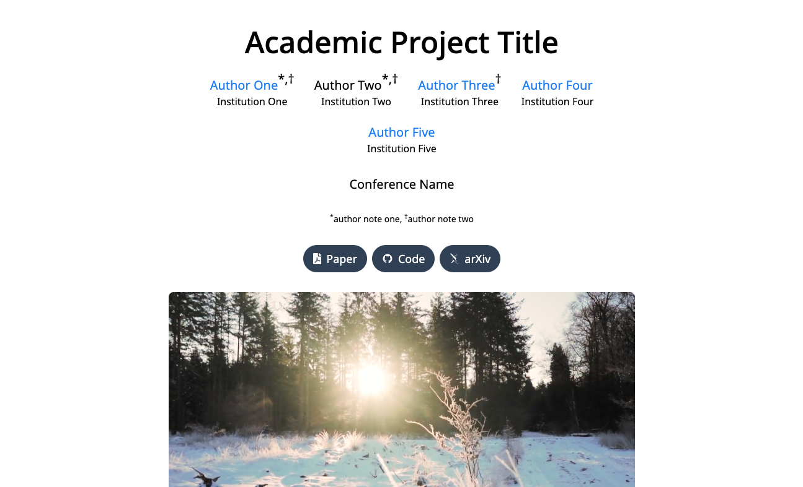

# Academic project page template

This is a template you can use to create a simple project page for your research paper. See a live demo [here](https://academic-project-astro-template.vercel.app/).

## Features

- **Astro framework**: Built using the [Astro](https://astro.build) web framework for fast and optimized static site generation and support for adding UI framework components like React, Preact, Svelte, Vue, SolidJS, AlpineJS and Lit.
- **Tailwind CSS**: Styled with [Tailwind CSS](https://tailwindcss.com/) for utility-first, responsive design.
- **MDX**: Edit the template in [MDX](https://mdxjs.com/), which allows you to write content in Markdown and use JSX variables, expressions, and components.
- **Native components**: Includes components for figures, videos, YouTube embeds, two-column sections, and LaTeX equations.
- **Code highlighting**: Syntax highlighting for code blocks using [Shiki](https://shiki.matsu.io/).
- **Responsive design**: Fully responsive layout that looks great on all devices.

## Usage

1. Click "Use this template" to make a copy of this repository and then clone it, or just clone it directly.
2. Run `npm install` from the root of the project to install dependencies.
3. Edit the template in `/src/pages/index.mdx`.
4. Run `npm run dev` to see a live preview of your changes and `npm run build` to build the website when you're done.
5. Host the website using [GitHub Pages](https://pages.github.com/), [Vercel](https://vercel.com), [Netlify](https://www.netlify.com/), etc.

## Notes

- If you're using VS Code, I recommend installing the [Astro extension](https://marketplace.visualstudio.com/items?itemName=astro-build.astro-vscode) to get IntelliSense, syntax highlighting, and other features.

## Credits

This template was adapted from Eliahu Horwitz's [Academic Project Page Template](https://github.com/eliahuhorwitz/Academic-project-page-template), which was adapted from Keunhong Park's [project page for _Nerfies_](https://nerfies.github.io/). It's licensed under a [Creative Commons Attribution-ShareAlike 4.0 International License](http://creativecommons.org/licenses/by-sa/4.0/).
