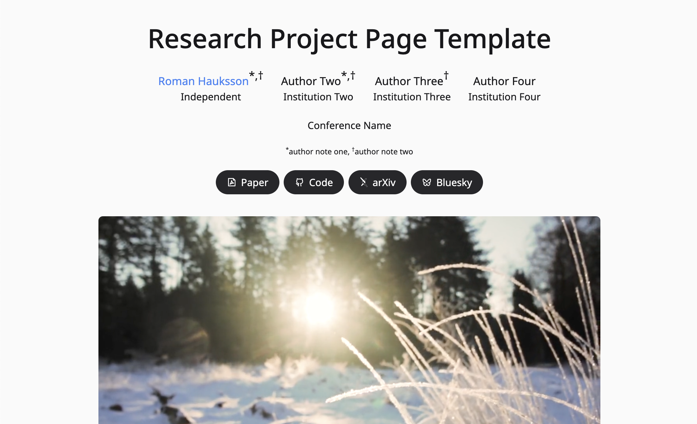
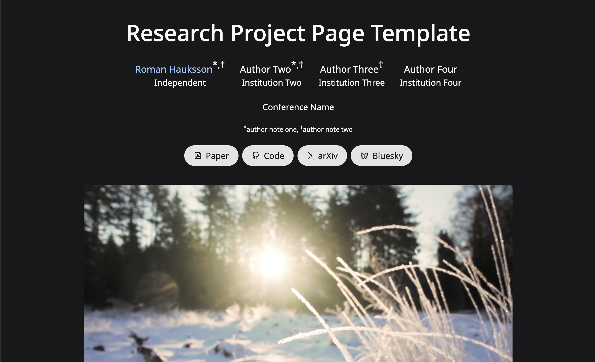

# Research project page template

This is a template you can use to build a project page for your research paper, adapted from the original [Nerfies page](https://nerfies.github.io/). It's designed to be easy to set up for those without web development experience, but web developers will appreciate that it's flexible and built with modern, familiar technologies. See a live demo of the template [here](https://research-template.roman.technology).

 

## Features

- Easily edit the content in Markdown instead of HTML.
- Quick-to-load, works with mobile devices, accessible, SEO-friendly, and supports dark mode.
- Includes out-of-the-box components for figures, image comparison sliders, LaTeX, two-column layouts, code blocks (with syntax highlighting), small caps, videos, and YouTube embeds.
- Add custom components using HTML or even other web frameworks like React, Vue, or Svelte.
- Built with [Astro](https://astro.build/), [Tailwind CSS](https://tailwindcss.com/), [MDX](https://mdxjs.com/), and [Typescript](https://www.typescriptlang.org/).

## Real-world examples

- [Token-Efficient Long Video Understanding for Multimodal LLMs](https://research.nvidia.com/labs/lpr/storm/) (NVIDIA Research)
- [Lossy Compression With Pretrained Diffusion Models](https://jeremyiv.github.io/diffc-project-page/) (ICLR 2025)
- [CLIP-RT: Learning Language-Conditioned Robotic Policies from Natural Language Supervision](https://clip-rt.github.io/)
- [StochSync: Stochastic Diffusion Synchronization for Image Generation in Arbitrary Spaces](https://stochsync.github.io/)
- [CRESSim: Simulator for Advancing Surgical Autonomy](https://tbs-ualberta.github.io/CRESSim/)
- [PCO: Precision-Controllable Offset Surfaces with Sharp Features](https://alan-leo-wong.github.io/SIGASIA24-PCO-ProjectPage/)

## Usage

Want help setting it up? Please schedule a call with me [here](https://cal.com/romanhauksson/meeting), and I'll personally walk you through making your project page live! I want to talk to potential users to figure out pain points and features to add.

1. [Install Node.js](https://nodejs.org/en/download/package-manager).
1. Click "Use this template" to make a copy of this repository and then clone it, or just clone it directly.
1. Run `npm install` from the root of the project to install dependencies.
1. Edit the content in `/src/pages/index.mdx`, and remember to update the favicon and social link thumbnail (optional). In the frontmatter in `index.mdx`, they are set to `favicon.svg` and `screenshot-light.png` respectively, which refer to files in `/public/`.
1. Run `npm run dev` to see a live preview of your page while you edit it.
1. Host the website using [GitHub Pages](https://pages.github.com/), [Vercel](https://vercel.com), [Netlify](https://www.netlify.com/), or any other static site hosting service.

[](https://app.netlify.com/start/deploy?repository=https://github.com/romanhauksson/academic-project-astro-template) [](https://vercel.com/new/clone?repository-url=https%3A%2F%2Fgithub.com%2FRomanHauksson%2Facademic-project-astro-template)

### Icons

This template uses the [Astro Icon](https://www.astroicon.dev/) library.

To use a custom icon:

1. Search on [Iconify](https://icon-sets.iconify.design/) to find the icon you want. For example, the Hugging Face icon is `simple-icons:huggingface`, from the Simple Icons icon set.
1. Install the corresponding icon set: `npm install @iconify-json/simple-icons`.
1. If you're using the icon in one of the link buttons, add it in one of the objects in the `links` prop of the `<Header />` component in `index.mdx`:

```mdx
    {
      name: "Hugging Face",
      url: "https://huggingface.co/",
      icon: "simple-icons:huggingface"
    }
```

Or, to use it anywhere in an Astro component or MDX file:

```mdx
import { Icon } from "astro-icon/components";

<Icon name={"simple-icons:huggingface"} />
```

### Notes

- If you're using VS Code, I recommend installing the [Astro extension](https://marketplace.visualstudio.com/items?itemName=astro-build.astro-vscode) to get IntelliSense, syntax highlighting, and other features.
- When people share the link to your project on social media, it will often appear as a "link preview" based on the title, description, thumbnail, and favicon you configured. Double check that these previews look right using [this tool](https://linkpreview.xyz/).
- The Nerfies page uses the Google Sans font, which is licensed by Google, so unfortunately, I had to change it to a different font instead (I picked Noto Sans).

## Alternative templates

- [Clarity: A Minimalist Website Template for AI Research](https://shikun.io/projects/clarity) by Shikun Liu. Beautiful and careful design that's distinct from the original Nerfies page. Editable via an HTML template and SCSS.
- [Academic Project Page Template](https://denkiwakame.github.io/academic-project-template/) by Mai Nishimura. Built with React and UIKit and editable with Markdown in a YAML file.

## Credits

This template was adapted from Eliahu Horwitz's [Academic Project Page Template](https://github.com/eliahuhorwitz/Academic-project-page-template), which was adapted from Keunhong Park's [project page for _Nerfies_](https://nerfies.github.io/). It's licensed under a [Creative Commons Attribution-ShareAlike 4.0 International License](http://creativecommons.org/licenses/by-sa/4.0/).
